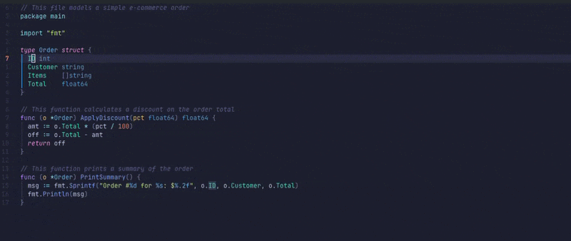

# ai_rename

AI-assisted variable renaming for Go files inside Neovim.

Place your cursor on any identifier, run `:AIRename`, and get three
context-aware rename suggestions powered by an LLM — then apply the one you
like with a single keypress via gopls project-wide.



---

## Features

- Understands the **full context** of a variable: type, assignments, usages, surrounding function, imports, and file comments
- Suggests **three idiomatic names** with short justifications
- Applies the rename **project-wide** through gopls (`textDocument/rename`)
- Supports **Claude** (default, via the `claude` CLI) and **Ollama** (`llama3:8b`)
- Works on local variables, parameters, struct fields, and type names

---

## Requirements

| Requirement | Notes |
|---|---|
| Neovim ≥ 0.9 | Tree-sitter + LSP built-in |
| gopls | Must be attached to the buffer |
| Tree-sitter Go parser | `:TSInstall go` |
| **Claude provider** | [`claude` CLI](https://github.com/anthropics/claude-code) installed and authenticated |
| **Ollama provider** | `ollama serve` running with `llama3:8b` pulled |

---

## Installation

**1. Clone into your Neovim config:**

```bash
git clone <repo-url> ~/.config/nvim/lua/ai_rename
```

**2. Build the Go binary:**

```bash
cd ~/.config/nvim/lua/ai_rename/go
go build -o ai_rename_bin ./cmd/
```

**3. Register the command** in your `init.lua`:

```lua
local ok, rename = pcall(require, "ai_rename.rename")
if ok then
  vim.api.nvim_create_user_command("AIRename", function(opts)
    local provider = opts.args ~= "" and opts.args or nil
    rename.suggest_and_rename(provider)
  end, { nargs = "?" })
end
```

---

## Configuration

These are the parts you are expected to adapt to your environment — the plugin does not expose a setup function today (see [issue #1](../../issues/1)):

| What | Where | Default | Change if… |
|---|---|---|---|
| Binary path | `rename.lua:5` | `~/.config/nvim/lua/ai_rename/go/ai_rename_bin` | You cloned to a different directory |
| Default provider | `rename.lua:57` | `claude` | You want Ollama as the default |
| Command registration | `init.lua` | Registers `:AIRename` automatically on `require("ai_rename")` | You want to register it yourself / skip auto-registration |

> If you cloned the repo to a non-standard path, edit line 5 of `rename.lua` to point to the actual binary location before use.

---

## Usage

Place your cursor on any identifier in a `.go` file and run:

```
:AIRename            " use Claude (default)
:AIRename ollama     " use Ollama / llama3:8b
```

A picker appears with three suggestions. Select one and the rename is applied
everywhere in the project via gopls.

**Suggested keymap:**

```lua
vim.keymap.set("n", "<leader>ra", "<cmd>AIRename<cr>", { desc = "AI Rename" })
```

---

## How It Works

```
cursor position
      │
      ▼
Tree-sitter  ──► identifier + enclosing function
      │
      ▼
Go binary (ai_rename_bin)
  • parses file with go/ast
  • collects type, usages, assignments, imports, doc comments
  • builds structured prompt
      │
      ▼
LLM  ──► 3 rename suggestions
      │
      ▼
vim.ui.select  ──► user picks one
      │
      ▼
gopls  ──► project-wide rename
```

---

## Providers

| Flag | Model | Requirement |
|---|---|---|
| *(default)* | Claude (via `claude -p`) | `claude` CLI authenticated |
| `ollama` | llama3:8b | `ollama serve` + `ollama pull llama3:8b` |

---

## Project Structure

```
ai_rename/
├── rename.lua               # Neovim plugin (Tree-sitter, UI, LSP)
├── init.lua                 # Command registration
└── go/
    ├── cmd/main.go          # CLI entry point
    ├── internal/rename/
    │   ├── run.go           # Orchestrator
    │   ├── context.go       # Variable context extraction
    │   ├── field_context.go # Struct field context extraction
    │   ├── resolve.go       # Identifier resolution
    │   ├── prompt.go        # LLM prompt builders
    │   ├── llm.go           # Claude / Ollama dispatch
    │   └── result.go        # Shared types
    └── testdata/
        ├── fibonacci.go
        ├── sample.go
        └── order.go
```

---

## Building

```bash
cd go && go build -o ai_rename_bin ./cmd/
```

No external Go dependencies — uses only the standard library and `go/ast`.

---

> **Authorship note:** The idea, architecture, and design are original work by the author.
> Code was implemented with AI assistance (OpenAI & Claude Code) under close human supervision and review.
